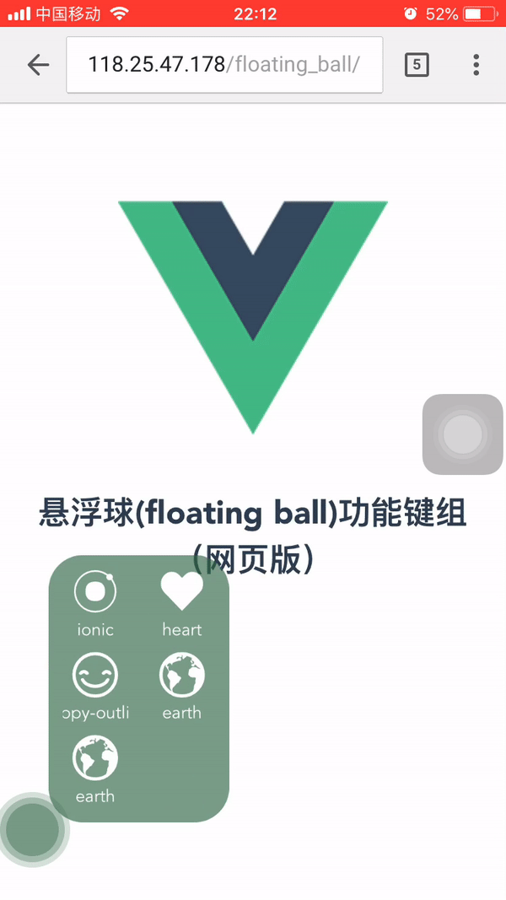

# vue-floating-ball

> A vue plug for showing floating ball. the floating ball can place at any specific size box, not only root box.

### Screenshots
###1. PC

###2. mobile


### install

By npm or yarn
```
npm install vue-floating-ball@latest -S

yarn add vue-floating-ball@latest
```
By CDN
```
<script src='vue-floating-ball.min.js'>
```

### Usage

Register component globally

```
// main.js
import Vue from 'vue'
import App from './App'
import VueFloatingBall from 'vue-floating-ball'

Vue.config.productionTip = false
Vue.use(VueFloatingBall)

new Vue({
  el: '#app',
  template: '<App/>',
  components: { App }
})

// App.vue
<template>
  <div id="app">
    <floating-ball :theme-color="themeColor" :init-position="initPosition" :popover-events="popoverEvents"></floating-ball>
  </div>
</template>

<script>

export default {
  name: 'App',
  data () {
    return {
      themeColor: '#316745',
      initPosition: 'top left',
      popoverEvents: [
        {parentName: 'App', eventName: 'show-data-ionic', iconName: 'ion-ionic', showName: 'ionic'},
        {parentName: 'App', eventName: 'show-data-heart', iconName: 'ion-heart', showName: 'heart'},
        {parentName: 'App', eventName: 'show-data-happy', iconName: 'ion-happy-outline', showName: 'happy-outline'},
        {parentName: 'App', eventName: 'show-data-earth', iconName: 'ion-earth', showName: 'earth'}]
    }
  },
  created () {
    this.$on('show-data-ionic', this.ShowDataIonic)
    this.$on('show-data-heart', this.ShowDataHeart)
    this.$on('show-data-happy', this.ShowDataHappy)
    this.$on('show-data-earth', this.ShowDataEarth)
  },
  methods: {
    ShowDataIonic () {
      alert('点击了ionic图标')
    },
    ShowDataHeart () {
      alert('点击了heart图标')
    },
    ShowDataHappy () {
      alert('点击了happy图标')
    },
    ShowDataEarth () {
      alert('点击了earth图标')
    }
  }
}
</script>

<style lang="scss" scoped>
#app {
  width: 100%;
  height: 500px;
}
</style>

```

or register locally in your `.vue` file

CDN example
```
<!DOCTYPE html>
<html>
<head>
    <meta charset="utf-8">
    <meta name="viewport" content="width=device-width,initial-scale=1">
    <title>vue-floating-ball</title>
    <script type="text/javascript" src="./js/vue.min.js"></script>
    <script type="text/javascript" src="./js/vue-floating-ball.min.js"></script>
    <style type="text/css">
        div#app {
            width: 100%;
            height: 500px;
        }
    </style>
</head>

<body>
    <div id="app">
        <floating-ball></floating-ball>
    </div>
    <script>
        new Vue({
            el: '#app'
        })
    </script>
</body>
</html>
```

### Docs

#### props

| Name        | Description           | Type           | default |
| -------------|:-------------:|:-------------:| -----:|
| themeColor     | set floating-ball primary color | String | #adadad |
| initPosition      | set floating-ball init position.(top/bottom/left/right) | string | bottom right |
| popoverEvents      | events will be displayed on the floating-ball popover | Array | [] |


#### popoverEvents props

| Name        | Description           | Type           | default |
| -------------|:-------------:|:-------------:| -----:|
| parentName     | parent component name | string | - |
| eventName      | event name | String | - |
| iconName     | icon name (使用[ionicons](http://ionicons.com/)) | string | - |
| showName      | word name | String | - |

```
// example
<script>
export default {
  name: 'App',
  data () {
    return {
      themeColor: '#316745',
      initPosition: 'top left',
      popoverEvents: [
        {parentName: 'App', eventName: 'show-data-ionic', iconName: 'ion-ionic', showName: 'ionic'},
        {parentName: 'App', eventName: 'show-data-heart', iconName: 'ion-heart', showName: 'heart'},
        {parentName: 'App', eventName: 'show-data-happy', iconName: 'ion-happy-outline', showName: 'happy-outline'},
        {parentName: 'App', eventName: 'show-data-earth', iconName: 'ion-earth', showName: 'earth'}]
    }
  },
  created () {
    this.$on('show-data-ionic', this.ShowDataIonic)
    this.$on('show-data-heart', this.ShowDataHeart)
    this.$on('show-data-happy', this.ShowDataHappy)
    this.$on('show-data-earth', this.ShowDataEarth)
  },
  methods: {
    ShowDataIonic () {
      alert('点击了ionic图标')
    },
    ShowDataHeart () {
      alert('点击了heart图标')
    },
    ShowDataHappy () {
      alert('点击了happy图标')
    },
    ShowDataEarth () {
      alert('点击了earth图标')
    }
  }
}
</script>
```


